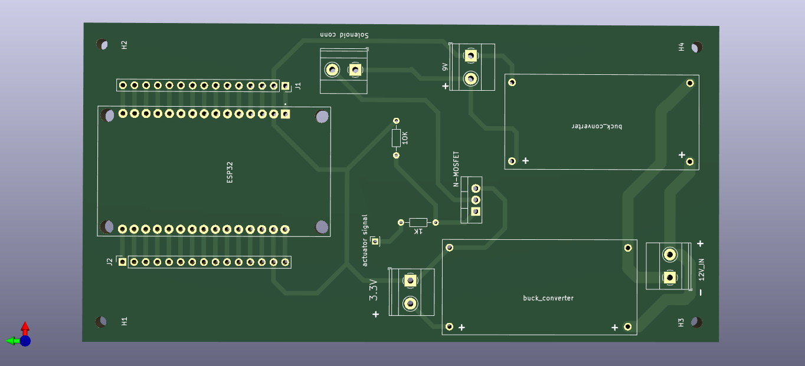

# Door Automation PCB

This PCB design was done using Kicad.

If you don't have Kicad installed on your system,you can download and install it from [here](https://www.kicad.org/download/).

You can checkout some Kicad documentation to get started [here](https://docs.kicad.org/).

## Schematic

The pdf version of the schematic is available in the schematic subfolder.

## PCB

The final PCB looks like this without components

It looks like this with components

